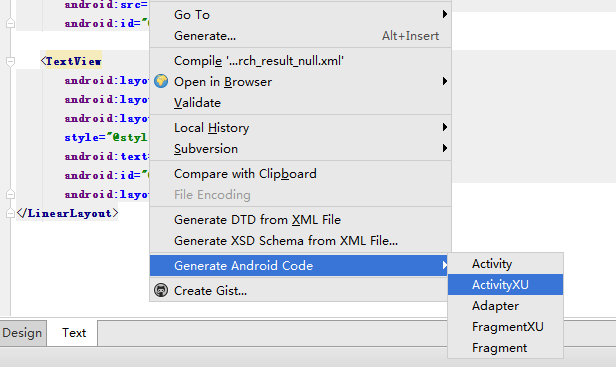
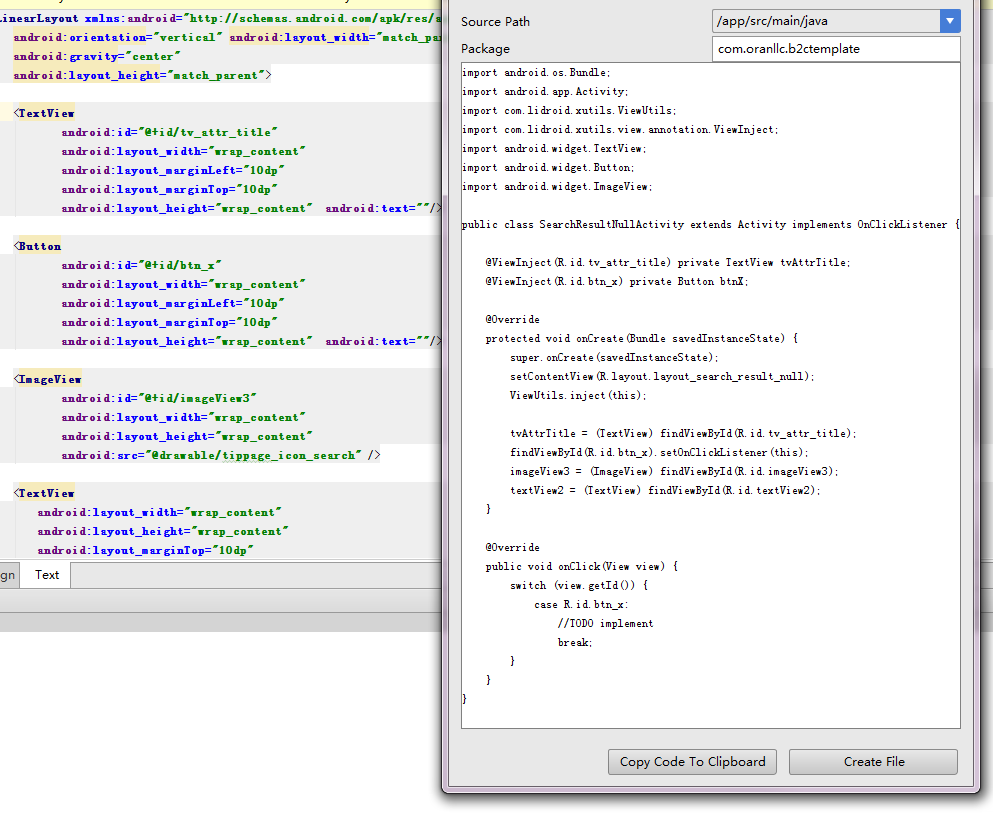

# AndroidCodeGeneratorPlugin-XU
##介绍##
-------
原本的项目是叫做[android-parcelable-intellij-plugin](https://github.com/mcharmas/android-parcelable-intellij-plugin)  
这是一个通过xml可以自动生成Activity,Fragment,适配器的代码或文件,以及Menu代码的插件. 
亮点在于可以通过`File → Settings → Other Settings → Android Code Generator`编辑代码模版来达到生成自定义Activity等自己想要的代码效果. 

但是该插件没法完全达到我想要的效果,于是我在其基础上尝试着做了一些修改.

##下载和安装##

- 下载[android-codegenerator-plugin-intellij.zip](https://github.com/anyanmolong/AndroidCodeGeneratorPlugin-XU/blob/master/android-codegenerator-plugin-intellij-master/android-codegenerator-plugin-intellij.zip) 文件并安装 `Preferences → Plugins → Install plugin from disk`

##使用方式##

 打开xml文件,右键点击对应菜单项 
 
 出现面板后选择`Source → "/app/.../java"` 并填写/修改文件的包名(选择创建文件的话会在该包名下创建文件) 
 代码太长超出屏幕时,点击代码后按下`Ctrl+Tab`来切换光标至按钮上
 

-------

版本1.0.0
>1.0.0 修改内容:
 1. 增加了带xUtilsVIewUtil注解的XU模版和XU菜单项(想要用xUils3的话应该改下模版里的xUils包路径就行了);
 2. 支持忽略以"activity_,fragment_,layout_"开头命名布局的activity等单词, 避免出现例如以fragment_cart.xml创建的Fragment类名称变成FragmentCartFragment.
 3. 支持忽略xml中系统自动命名的"textView1,linearLayout2"的view
 4. 增加"FIELDS_XU"模版关键字, 对view成员进行ViewUtils绑定
